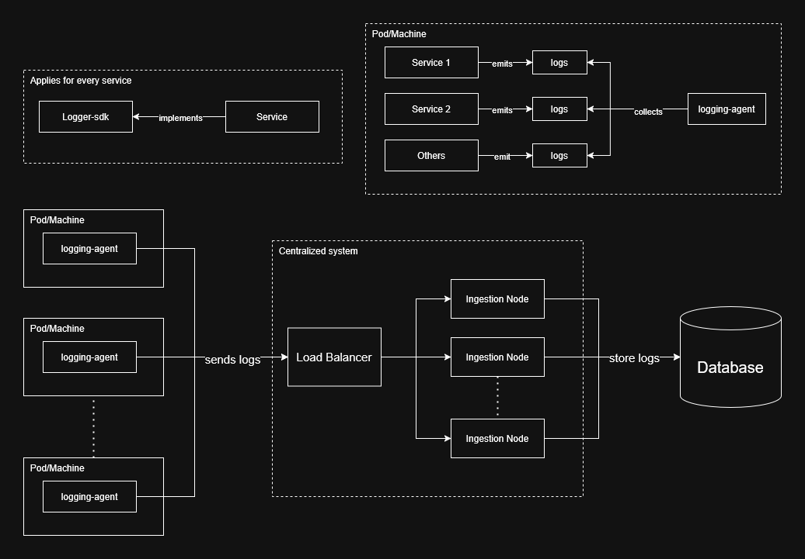

# Distributed Logging system

A distributed logging system built in Go to explore the internals of log ingestion, buffering, persistence, durability, and distributed system guarantees.

This project is designed as a learning-oriented implementation of a scalable logging pipeline with storage, ingestion, buffering, and delivery guarantees.

## Components

### 1. Logging SDK
The Logging SDK is integrated directly into application services and acts as the primary interface for emitting logs.

#### Responsibilities
- Generate structured logs
- Support log levels
- Write logs locally to:
  - files
  - stdout
- Provide a base logger implementation
- Allow extensibility for custom services

#### Design Goals
- Lightweight
- Independent from distributed infrastructure
- Minimal runtime overhead
- Easy integration into services

#### Example Log Structure
```json
{
  "timestamp": "2026-05-20T12:00:00Z",
  "service": "user-service",
  "level": "info",
  "message": "User login successful"
}
```

For more information checkout [`logging-sdk readme`](https://github.com/krishnaZawar/distributed-logger/blob/master/logger-sdk/readme.md)


### 2. Services
Services are the applications that use the Logging SDK to emit logs into the distributed logging system.

#### Responsibilities
- Integrate the Logging SDK
- Emit structured logs

**Note: This can be used in any service/application you want to track**


### 3. Logging Agent
The Logging Agent is responsible for collecting logs generated by services and forwarding them reliably to the centralized logging infrastructure.

It acts as the bridge between locally generated logs and the distributed logging pipeline.

The agent is designed to operate independently from application services to ensure that logging failures do not affect application execution.

#### Responsibilities
- Monitor configured log sources
- Continuously tail log files
- Detect newly appended logs
- Buffer and batch logs
- Retry failed transmissions
- Forward logs to ingestion nodes
- Maintain delivery guarantees

#### Design Goals
- Reliable log shipping
- Fault tolerance
- Decoupling from application services
- Efficient batching and buffering

For more information checkout [`logging-agent readme`](https://github.com/krishnaZawar/distributed-logger/blob/master/logging-agent/readme.md)


### 4. Ingestion Node
The Ingestion Node is the centralized entry point for logs coming from Logging Agents. It acts as a bridge between distributed log collection and downstream log storage systems.

It is designed to validate and enrich incoming data, and forwarding logs to storage.

#### Responsibilities
- Receive logs from Logging Agents
- Validate incoming log payloads
- enrich log data
- Forward logs to Log Storage
- Maintain reliability under high load

#### Design Goals
- Decoupling between agents and storage
- Minimal processing overhead
- Horizontal scalability readiness
- Reliable forwarding to storage layer

For more information checkout [`ingestion-node readme`](https://github.com/krishnaZawar/distributed-logger/blob/master/ingestion-node/readme.md)


### 5. Log Storage
Log Storage is the durable persistence layer of the distributed logging system. It is responsible for reliably storing all ingested logs and ensuring they can be replayed, queried, and recovered after failures.

It is the final stage in the log pipeline and plays a critical role in guaranteeing durability, ordering, and correctness.

#### Responsibilities

- Persist logs durably to disk
- Maintain ordering guarantees per source
- Provide crash recovery mechanisms
- Ensure data integrity and corruption detection
- Serve as the source of truth for all logs

#### Design Goals

- Strong durability guarantees
- Sequential and efficient writes
- Fast recovery after crashes
- Minimal data loss under failures
- Predictable write performance
- Support for future query and indexing layers

## Log flow from Services to centralized storage

<div style="text-align:center;">
        
</div>

> **Note:** This flow is sufficient for most systems. However, for very high-throughput workloads, it is recommended to introduce a message queue (e.g., Kafka) between the Ingestion Node and Log Storage.  
> This decouples producer and consumer throughput, prevents backpressure from directly impacting the database, and ensures the storage layer is not overwhelmed by heavy write loads.

## Scalability

The distributed logging system is designed to handle increasing log volume, multiple services, and high-throughput ingestion without compromising reliability or durability.

Scalability is achieved by decoupling system components and introducing buffering layers between producers and consumers.


### Horizontal Scalability

#### Services
- Multiple services can independently emit logs using the Logging SDK
- No coordination required between services
- Scaling services increases log volume linearly

#### Logging Agents
- One or more agents can run per host/container
- Agents scale independently of services
- Each agent handles a subset of log sources
- Multiple agents can be deployed for high-density environments

#### Ingestion Nodes
- Stateless design enables horizontal scaling
- Multiple ingestion nodes can run behind a load balancer
- Requests are distributed across nodes
- Scaling ingestion improves handling of burst traffic


### Decoupling for Scalability

#### Logging Agent → Ingestion Node
- processes logs in batches for transmission, avoids sends all the logs at once
- Handles retries
- Prevents direct coupling between services and ingestion

#### Ingestion Node → Storage
- Buffers incoming logs before persistence
- Smooths burst traffic
- Prevents storage overload

### Message Queue Integration (High Throughput Scaling)

For very high throughput systems, a message queue (e.g., Kafka) can be introduced between ingestion and storage.

### Benefits
- Decouples write speed from storage capacity
- Provides durable buffering layer
- Smooths traffic spikes

```
Ingestion Node → Message Queue → Storage Consumer → Log Storage
```

## Current Design Choices
1. The current system uses simple log files instead of a database for log storage. This decision was made to keep the implementation simple and focused on learning goals, as this is primarily an educational project. In a production-grade system, a more robust log storage solution such as OpenSearch would be more appropriate for indexing, querying, and analytics.

2. Log files currently do not implement rotation. Without rotation, log files can grow indefinitely, which may lead to disk space issues. Ideally, logs should support rotation policies (size-based or time-based) and be discarded once successfully delivered. This feature is not implemented.

3. The Logging Agent does not currently support authentication when sending logs to the Ingestion Node. This means there is no secure verification of agent identity, which would be necessary in a production environment to prevent unauthorized log ingestion.

4. The Logging Agent can only track explicitly configured log files. It does not support automatic discovery of log files within a directory. Ideally, the agent should be able to monitor a configured folder and dynamically detect new log files created by services.

5. The Ingestion Node does not currently support configurable downstream routing for logs. This limits flexibility in forwarding logs to different processing systems or storage backends based on log type, service, or metadata.

6. A message queue is not implemented in the current architecture due to the relatively low throughput requirements of the system. However, in high-scale environments, introducing a queue (such as Kafka) would help decouple ingestion from storage and improve resilience under heavy load.

> These design choices were made intentionally to enable faster development and to focus on understanding the core concepts behind distributed logging systems. The goal of the project is learning-oriented, prioritizing clarity of system behavior over production-grade completeness.

## Guarantees

The system is designed to provide reliable log delivery across multiple layers of the pipeline, even in the presence of failures such as network issues, process crashes, or temporary unavailability of downstream components.

These guarantees define how logs move through the system and what can be expected in failure scenarios.

###  1. At-Least-Once Delivery
The system provides **at-least-once delivery semantics**.

#### Meaning
- Every log is guaranteed to be delivered **at least once** to Log Storage.
- In failure scenarios, the same log **may be delivered multiple times**.

#### Why this choice?
- Simpler system design
- Avoids complex distributed deduplication logic
- Suitable for logging systems where duplication is acceptable


### 2. No Silent Log Loss (Best Effort Guarantee)
The system is designed to avoid silent log loss under normal operating conditions.

#### Ensured by:
- Local file logging in Services
- delivery guarantees in the Logging Agent
- Retry mechanisms on failure
- Persistent storage in Log Storage

#### Limitations:
- In extreme cases (disk failure, forced shutdown, corruption), loss may still occur


### 3. Ordering Guarantees

#### Per-Source Ordering
- Logs from a single service/source are preserved in order
- Ordering is maintained through:
  - sequential writes in Log Storage
  - ordered batching in Logging Agent

#### Cross-Service Ordering
- No global ordering is guaranteed across services
- Ordering is only meaningful within a single source stream

## Extendability

The current system is designed with clear separation of concerns, which makes it easy to extend into more advanced observability and analytics use cases.

### 1. Querying Layer

The Log Storage can be extended with a query interface to enable searching and filtering logs.

#### Possible enhancements:
- Full-text search on log messages
- Filtering by:
  - service name
  - log level
  - time range
- Indexed storage for faster lookups

### 2. Visualization Layer

A visualization layer can be added on top of the storage system to make logs more meaningful and actionable.

#### Possible features:
- Dashboard for real-time log streaming
- Error rate graphs per service
- Latency and request trend visualization
- Service-wise log breakdown
- Heatmaps for traffic spikes

### 4. Indexing and Search Optimization

To support large-scale querying:
- Build inverted indexes for log messages
- Partition logs by service or time window

### 5. Integration with Observability Tools

The system can evolve to integrate with standard observability stacks.

#### Potential integrations:
- OpenTelemetry for traces and metrics
- OpenSearch or Elasticsearch for log indexing
- Grafana for visualization dashboards

### 6. Streaming and Real-Time Processing

Logs can be streamed for real-time processing:
- Detect anomalies in real time
- Trigger alerts on error spikes
- Real-time dashboards for system health

## Future Scope for Development
1. Implementing log rotation to prevent unbound growth of log files
2. Implement the logging agent to auto discover log files in a configured folder
3. Use a database for storage over naive log files
4. Add a message queue between ingestion node and log storage to make it suitable for heavy write environments
5. Add Auth to the system to make it more secure
6. Allow searching, filtering of logs to gain value from the collected logs